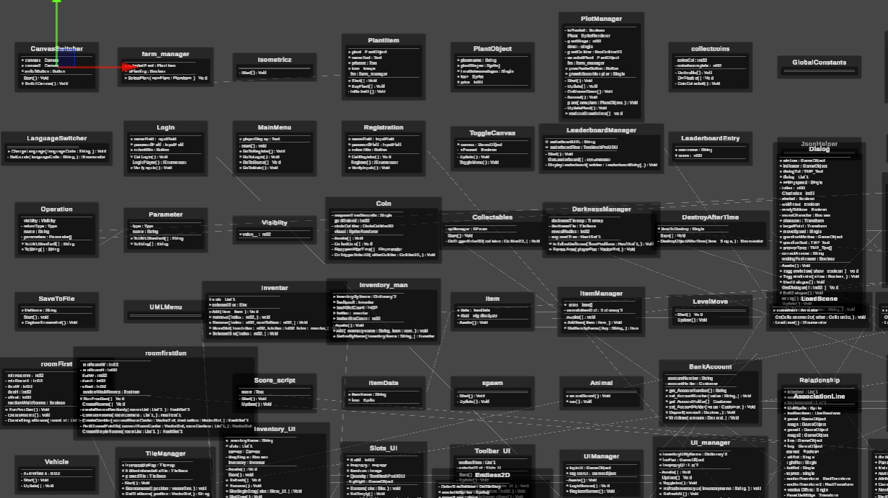
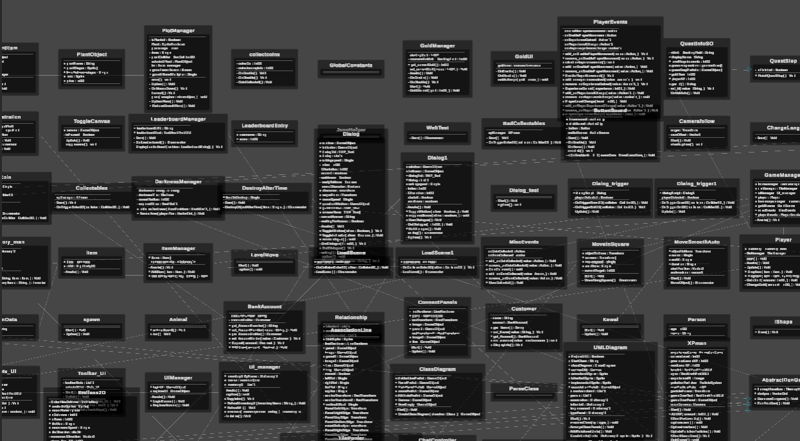
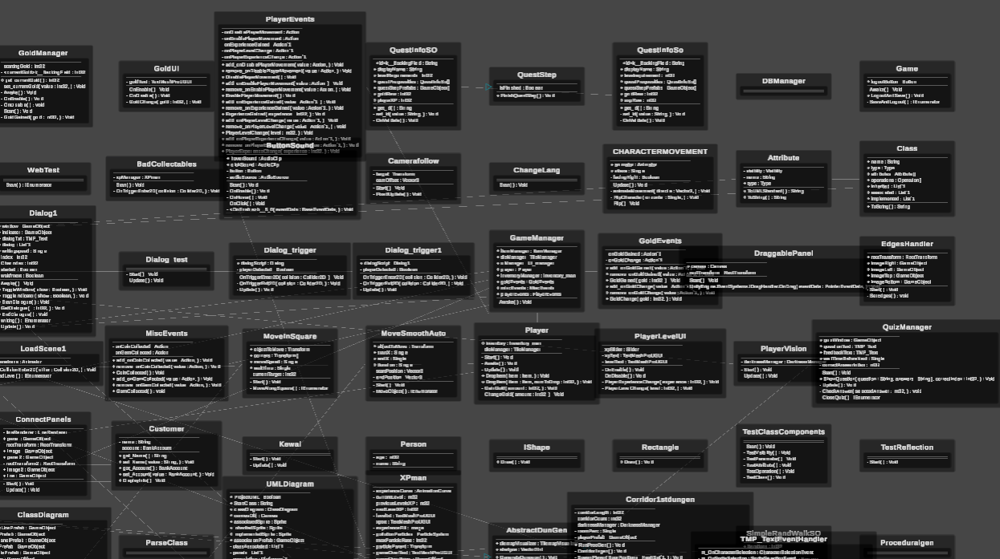
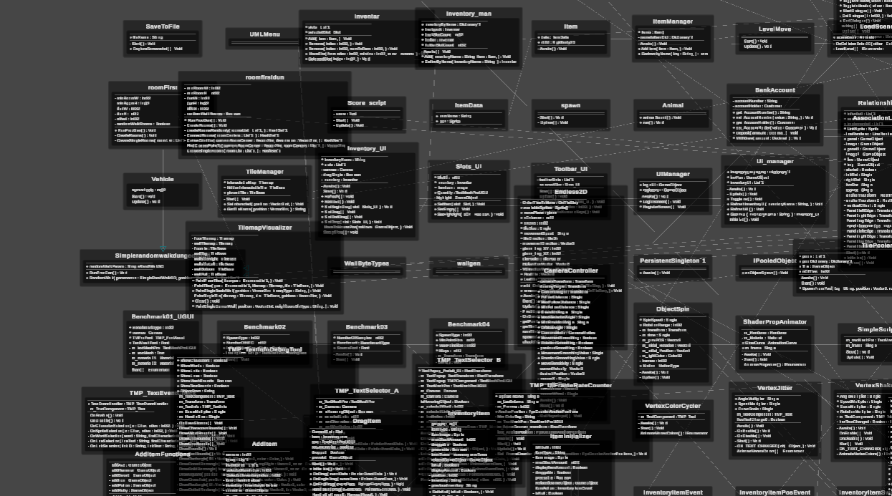
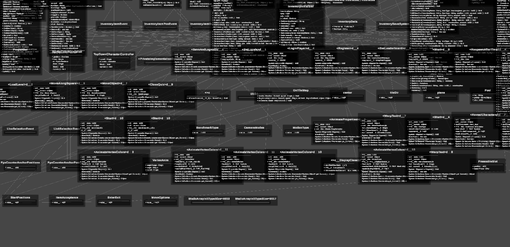
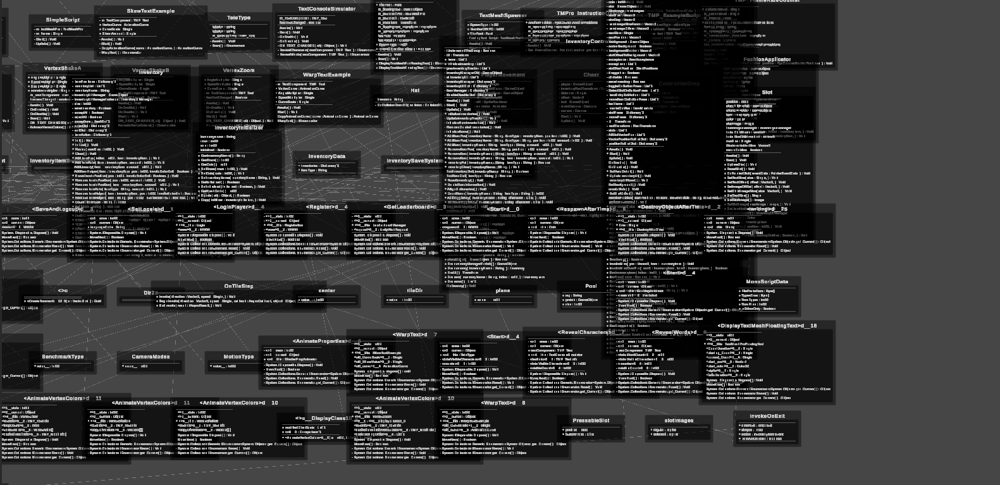
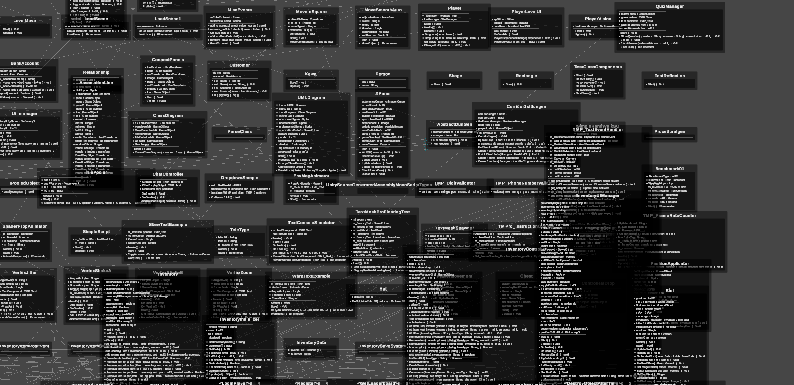

# EcoTopia 
 EcoTopia este o aplicație educațională inovatoare care transformă învățarea despre ecologie într-o experiență interactivă și vizuală.
Elevii învață prin simulări și alegeri reale, văzând consecințele ecologice în timp real asupra unui oraș virtual.
Aplicația dezvoltă gândirea critică, implicarea civică și conștiința de mediu într-un mod captivant.
Profesorii pot crea și edita lecții, întrebări și teste direct în joc, fără cunoștințe tehnice.
Platforma oferă uneltele necesare pentru evaluarea elevilor, inclusiv scoruri, timp petrecut și export în Excel.
Se poate adapta ușor pentru diverse teme din educația ecologică și sustenabilitate.
Interfața este intuitivă, iar diferențierea între conturile de elev și profesor asigură o experiență organizată.
Rezultatele pot fi analizate pe clase, oferind feedback concret pentru profesori.
***EcoTopia este mai mult decât un joc – este o punte între educație, tehnologie și responsabilitate socială.***

---
## Funcționalități Educaționale

 *Pentru elevi:*
-Feedback Vizual Imediat
  Sistemul de feedback este gândit vizual. Acest mecanism întărește învățarea prin experimentare și responsabilitate.
- Învață din lecții atât citind cât și vizionând videoclipuri (postate de profesori)
- Rezolvă teste grilă al căror scor se salvează automat
- Lecții structurate
- Lecțiile sunt prezentate sub formă de texte scurte + imagini, integrate direct în joc
- Competiție prietenoasă
  Elevii se pot compara între ei pe baza scorului obținut, ceea ce aduce un plus de motivație și spirit competitiv

 *Pentru profesori:*
- Creează, editează și organizează lecții și întrebări
- Creează teste personalizate pentru elevi
- Creează clase și monitorizează scorurile elevilor
-Export de Date în Excel
 Cu un singur click, profesorul poate exporta scorurile, timpul petrecut, întrebările parcurse și data testării într-un fișier Excel – ideal pentru notare și analiză.
- Profesorii pot adăuga lecții
- Alți profesori pot importa lecțiile în documente Word și totodată să lase comentarii
- 
---

##  Tehnologii Folosite
 Unity (C#)  
 MySQL + PHP (bază de date)  
 Export Excel (note & scoruri)  
 MAMP
 
---
## Cum instalezi aplicația?

### 1. Descarcă și instalează MAMP
- Site oficial: [https://www.mamp.info/en/](https://www.mamp.info/en/)
- Instalează versiunea gratuită (MAMP)
- După instalare, pornește aplicația și apasă **Start Servers**

### 2. Copiază în folderul htdocs fișierul sqlconnect

### 3. Mergi pe site-ul MyPhPAdmin, creează o nouă bază de date (cu numele logindatabaseunity), importă fisierul logindatabaseunity.php

### 4. Felicitări acum proiectul este funcțional și pe dispozitivul tău! Distracție plăcută!

Link-uri utile:[https://drive.google.com/drive/folders/1XfBhbcaveDR_LlVjHGNdrAUO7t4jn2uH?usp=drive_link]
Link documentație##:[https://docs.google.com/document/d/1zlbEwQTRsabV007BzqbzmKZdBEunulrIVDJs7HbiT-8/edit?usp=drive_link]

---

💥WOW-FACTOR💥
### 1. Editor Complet Vizual pentru Profesori
 Editorul complet vizual pentru profesori din aplicație permite profesorilor să creeze teste, cursuri și opțiuni ecologice fără a scrie cod. Totul se întâmplă prin meniurile ușor de înțeles ale interfeței jocului, făcând aplicația accesibilă oricărui profesor, indiferent de experiența digitală.

### 2. Evaluare Automată + Export Excel
 Rezultatele elevilor, inclusiv scorurile, timpul petrecut și răspunsurile, sunt salvate automat în baza de date și pot fi exportate în Microsoft Excel. Prin urmare, profesorii au capacitatea de a analiza evoluția elevilor, de a acorda note rapid și de a crea statistici pe clasă sau pe lecție.

### 3. Extensibilitate Tematică
 EcoTopia este construită modular, ceea ce înseamnă că profesorii sau dezvoltatorii pot adăuga noi lecții, teme și simulări (ex: apă, biodiversitate, energie, reciclare). Aplicația nu este limitată la un singur subiect, ci poate crește odată cu nevoile școlii.

### 4. Educație prin Simulare, Nu Doar Informare
 Majoritatea platformelor de educație oferă teste sau informații. EcoTopia merge mai departe, oferind elevii simulări active care îi pun în situații reale din viață. În mod similar cu ceea ce se întâmplă în viața reală, aceștia iau decizii și învață din ele.

### 5. Alegeri cu ramificații multiple (!!!în dezvoltare)
 EcoTopia nu se limitează la un singur punctaj. Unul dintre cele mai remarcabile aspecte este faptul că alegerile elevilor se combină și creează scenarii finale variate pentru orașul virtual. Acest sistem de finalizări alternative are un impact semnificativ asupra elevilor. Astfel, pot vedea consecințele directe ale alegerilor lor, ceea ce îmbunătățește învățarea și responsabilitatea față de mediu.

 ### 6. Acces diferit pentru roluri
  Conturile de profesor și elev sunt diferite ca funcționalitate, pentru a evita confuzia și pentru a păstra structura organizată.
 
 ---

 
 
 
 
 
 
 
 
 
 
 
 
 
 
 

