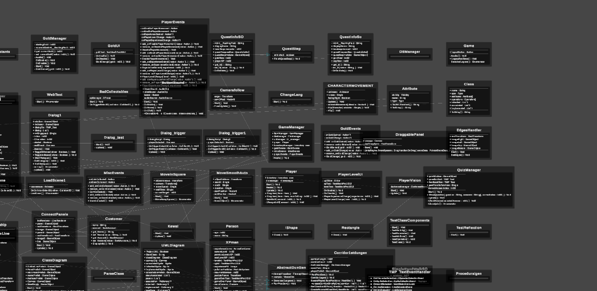

# **Biotopia - Educational Game**

⚛️**Biotopia** este un joc educativ destinat celor care doresc să învețe despre biodiversitate, ecologie și chimie într-un mod interactiv și captivant. Explorează o lume virtuală plină de organisme, plante, ecosisteme și chimie, în timp ce înveți cum funcționează viața pe Pământ!

# **Diagrama UML- closeup** 
Am adăugat un UML al jocului pentru a vizualiza și organiza structura internă a jocului, incluzând clasele și relațiile dintre ele. Prin acest lucru, doresc să facilitez înțelegerea interacțiunilor dintre diferitele componente, cum ar fi plantele, fertilizatorii și modul de asimilare al cunoștințelor. UML-ul ajută la o dezvoltare mai eficientă și o întreținere mai ușoară pe măsură ce jocul evoluează.

